# FocusSaga XP

<p align="center">
  
</p>

<p align="center">
  <b>Gamified study timer app where users focus, earn XP, level up characters, unlock seasons, and climb rankings.</b>
</p>

<p align="center">
  
  
  
  
</p>

---

## Overview

**FocusSaga XP** is a Flutter-based gamified study timer app.

The app helps users stay consistent by turning focused study sessions into a game-like progression system. Users set a timer, study, earn XP, level up characters, receive coins, unlock beautiful animated seasons/backgrounds, complete daily challenges, and compete on leaderboards.

The goal is simple:

> Make studying feel rewarding without making the app complicated.

---

## Screenshots

> Add your real screenshots inside `assets/screenshots/`.

<p align="center">
  
  
  
</p>

<p align="center">
  
  
  
</p>

---

## Core Features

- Anonymous Supabase auth for frictionless start
- Optional profile name setup
- Terms and Privacy acceptance flow
- Tutorial/onboarding flow
- Focus countdown timer
- Timer presets: `25 min`, `50 min`, `2 hours`, custom timer
- Pause, resume, and finish early
- XP based on actual focused minutes
- Character leveling system
- 50 starting coins
- 20 coins per level clear
- Unlockable characters
- Unlockable animated seasons/backgrounds
- Unlockable timer skins
- Unlockable reward animations
- Daily challenges
- Daily and weekly leaderboard
- Profile stats
- Soft UI / Clean Pastel Minimal UI
- Transparent/semi-transparent panels over animated backgrounds

---

## Core App Flow

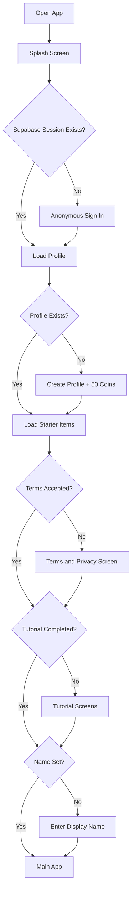

---

## Main Navigation

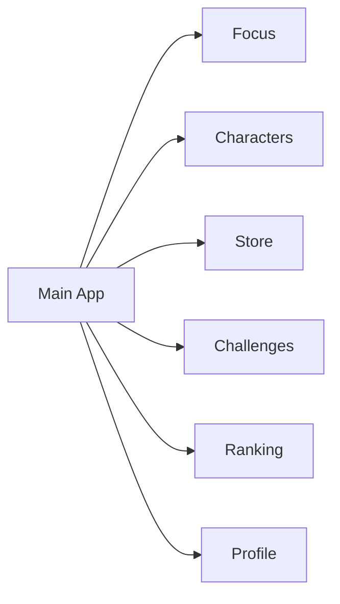

---

## Game Loop

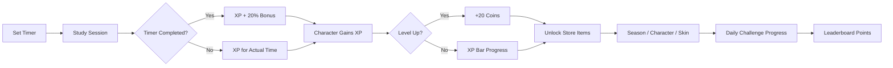

---

## Tech Stack

| Layer | Technology |
|---|---|
| Mobile App | Flutter |
| Language | Dart |
| Backend | Supabase |
| Auth | Supabase Anonymous Auth |
| Database | Supabase Postgres |
| Storage | Supabase Storage |
| State Management | Riverpod |
| Routing | go_router |
| Images | Local assets + Supabase Storage |
| Animation | Flutter CustomPainter / Animated Widgets |
| Future Animation | Flame / Rive |
| Version Control | GitHub |

---

## System Architecture

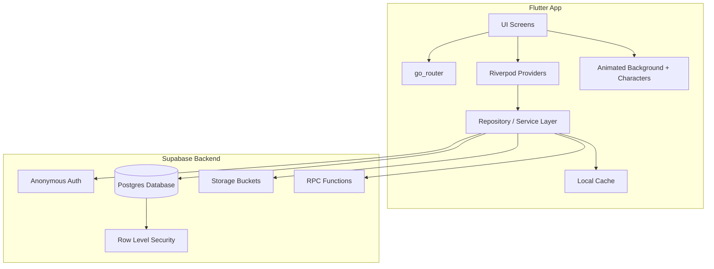

---

## Timer State Machine

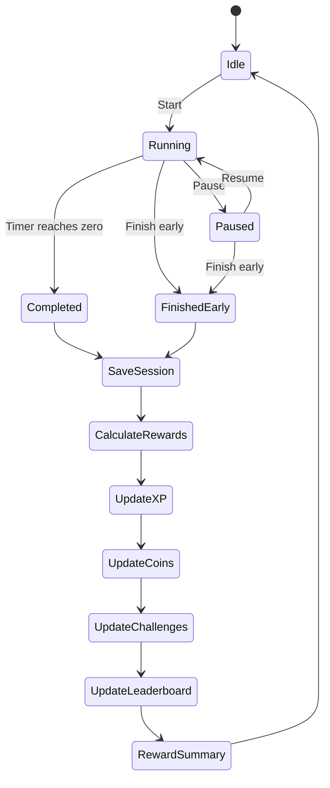

---

## XP and Coin System

| Rule | Value |
|---|---|
| Focused time | `1 XP / minute` |
| Full completion bonus | `+20% XP` |
| XP per level | `100 XP` |
| Level reward | `20 coins` |
| Starting coins | `50 coins` |
| Max session length | `3 hours` |
| Level cap | `50` |

### XP Formula

```text
base_xp = actual_focused_minutes

if completed == true:
    final_xp = round(base_xp * 1.2)
else:
    final_xp = base_xp
```

### Example

| Session | Actual Time | Completed | XP |
|---|---:|---|---:|
| Quick Focus | 25 min | Yes | 30 XP |
| Deep Work | 120 min | Yes | 144 XP |
| Early Finish | 18 min | No | 18 XP |

---

## Reward Distribution

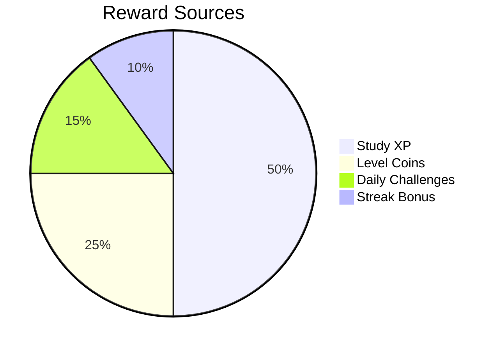

---

## Characters

Characters are original mature fantasy/anime-inspired warriors.  
No copyrighted anime, Marvel, DC, game, movie, or cartoon characters are used.

### Character Types

| Character | Theme | Style |
|---|---|---|
| Kairo | Flame Ronin | Muscular fire swordsman |
| Tetsu | Iron Vanguard | Heavy armored warrior |
| Rin | Storm Blade | Lightning dual-blade fighter |
| Kuro | Shadow Assassin | Dark sword assassin |
| Sora | Astral Champion | Cosmic sword warrior |
| Arashi | Wind Samurai | Wind katana warrior |

### Character Evolution

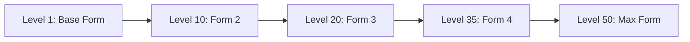

---

## Animated Seasons

FocusSaga XP uses unlockable global animated seasons.  
Each season changes the full app background and creates a different mood.

### Season Unlocks

| Season | Status | Visual |
|---|---|---|
| Forest Morning | Free / Default | Trees, blurred mountains, falling leaves |
| Rainy Window | Locked | Rain drops and soft blue mood |
| Snow Pine | Locked | Snow, pine trees, distant mountains |
| Sunset Garden | Locked | Warm sunset, petals, garden silhouettes |
| Neon Night | Locked | Dark neon particles |
| Cherry Blossom | Locked | Pink petals and soft spring background |
| Celestial Aurora | Final Legendary | Aurora sky, cosmic particles, premium final unlock |

### Season Unlock Flow

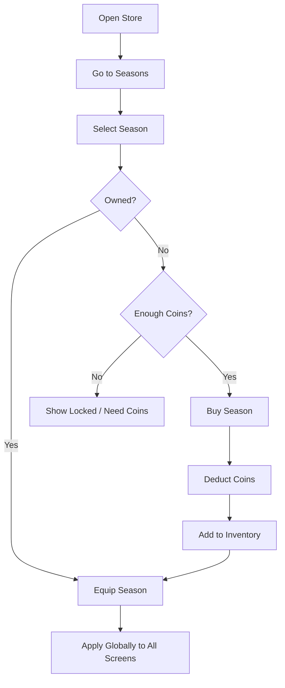

---

## Global Background System

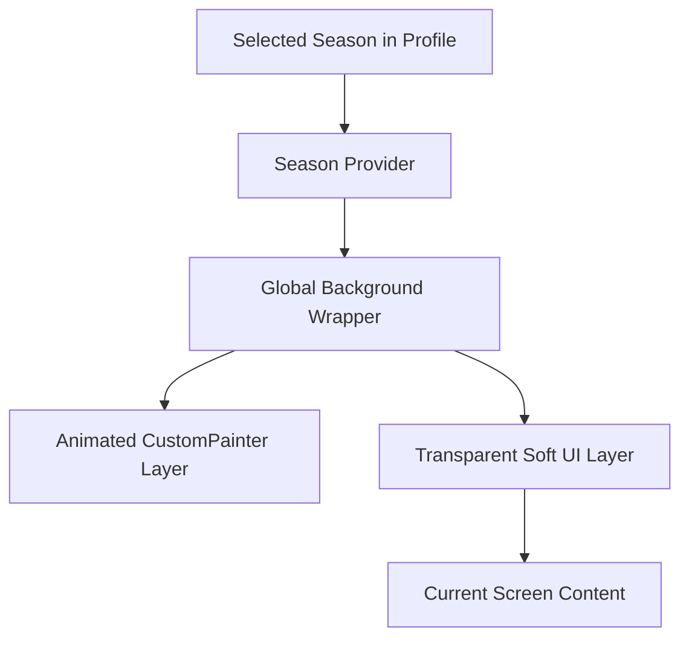

Background rules:

- One global background layer wraps all screens
- UI cards are semi-transparent
- Text remains readable
- Particles are lightweight
- Store previews stay static for performance
- Only equipped season animates globally

---

## Store System

Store categories:

- Characters
- Seasons
- Backgrounds
- Timer skins
- Reward animations

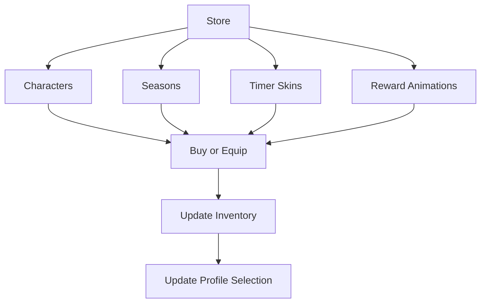

---

## Daily Challenges

Example challenges:

- Study 25 minutes today
- Complete 2 sessions
- Study 120 minutes total
- Complete a session without pause
- Level up a character
- Unlock or equip a season

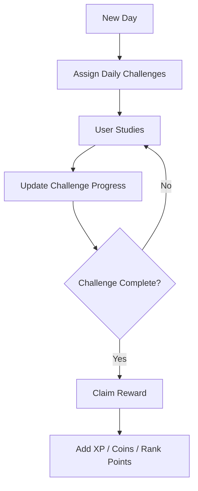

---

## Leaderboard

Leaderboard rank is based on real study activity, not coins or purchases.

```text
rank_points = focused_minutes + challenge_bonus + streak_bonus
```

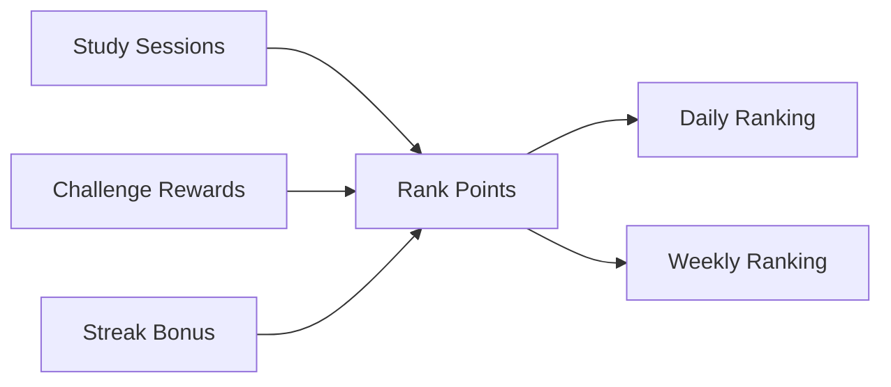

---

## Database Design

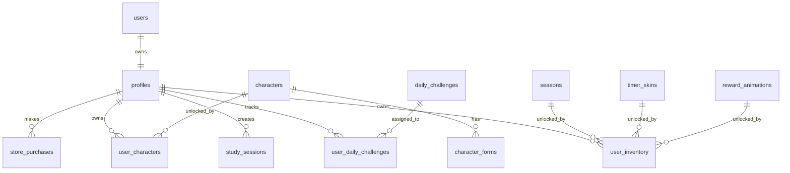

---

## Main Database Tables

| Table | Purpose |
|---|---|
| profiles | User profile, coins, level, selected season |
| terms_acceptance | Terms and privacy acceptance |
| characters | Character catalog |
| character_forms | Evolution forms |
| user_characters | User-owned characters and XP |
| seasons/backgrounds | Unlockable app backgrounds |
| timer_skins | Timer styles |
| reward_animations | Reward effects |
| user_inventory | Owned items |
| store_purchases | Purchase history |
| study_sessions | Focus session records |
| daily_challenges | Challenge templates |
| user_daily_challenges | User challenge progress |

---

## Flutter Folder Structure

```text
lib/
  main.dart
  app/
    app.dart
    router.dart
    theme.dart
    app_shell.dart
  core/
    constants/
    utils/
    errors/
  services/
    supabase_service.dart
    auth_service.dart
    profile_service.dart
    timer_service.dart
    store_service.dart
    challenge_service.dart
    ranking_service.dart
  features/
    auth/
    onboarding/
    terms/
    focus/
    characters/
    store/
    challenges/
    ranking/
    profile/
  shared/
    widgets/
      season_background_widget.dart
      soft_panel.dart
      character_idle_widget.dart
    models/
    styles/
```

---

## Asset Structure

```text
assets/
  brand/
    focussaga-wordmark.png
    focussaga-icon.png

  screenshots/
    focus.png
    characters.png
    store.png
    challenges.png
    ranking.png
    profile.png

  characters/
    kairo/
      preview.png
      form_1.png
      form_2.png
      form_3.png
      form_4.png
      form_5.png

  seasons/
    forest_morning/
      preview.png
    rainy_window/
      preview.png
    snow_pine/
      preview.png
    sunset_garden/
      preview.png
    neon_night/
      preview.png
    cherry_blossom/
      preview.png
    celestial_aurora/
      preview.png
```

---

## Performance Strategy

- Cache master data like characters, seasons, timer skins, and reward animations
- Do not call Supabase inside widget build methods
- Use Riverpod providers with loading/error/data states
- Use `RepaintBoundary` around animated backgrounds
- Keep particle count low
- Use pagination for leaderboard
- Use indexes on frequent query fields
- Avoid infinite loading screens
- Show retry buttons on errors

---

## Security Rules

- Users can read/write only their own profile data
- Users can read public master data
- Users cannot edit store catalog data
- Store purchases are atomic
- Duplicate purchases are blocked
- Coins cannot go negative
- Session rewards are guarded against double save
- Leaderboard does not use paid coins or purchases

---

## MVP Roadmap

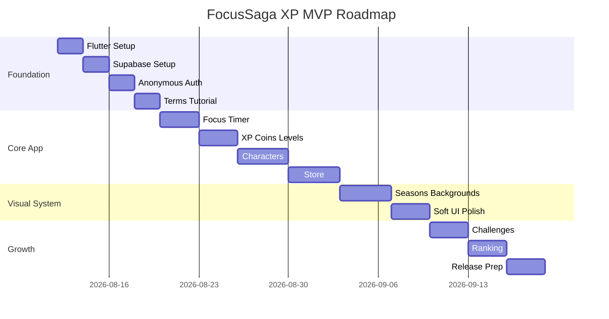

---

## Setup Requirements

Required tools:

- Flutter SDK
- Android Studio
- VS Code
- Git
- Supabase account
- GitHub account

Run project:

```bash
flutter pub get
flutter run
```

Run in Chrome:

```bash
flutter run -d chrome --web-port 50068
```

Build Android App Bundle:

```bash
flutter build appbundle --release
```

---

## Legal Rules

This app should use only original assets.

Do not use:

- Real anime characters
- Real anime transformation names
- Marvel or DC characters
- Movie/game/cartoon characters
- Protected logos
- Copied costume designs

---

## Future Scope

- Real Google login
- Friends leaderboard
- Class/group ranking
- Flame sprite animations
- Rive premium backgrounds
- Push notifications
- Streak freeze
- Parent/teacher reward dashboard
- Premium cosmetic packs
- Play Store release

---

## License

No license selected yet.

Before public release, decide whether the project should remain proprietary or use an open-source license such as MIT or Apache-2.0.
