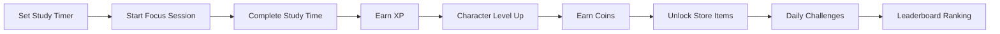
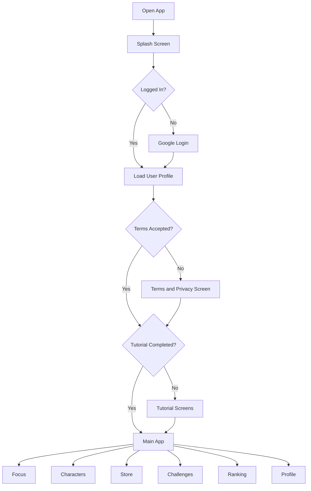
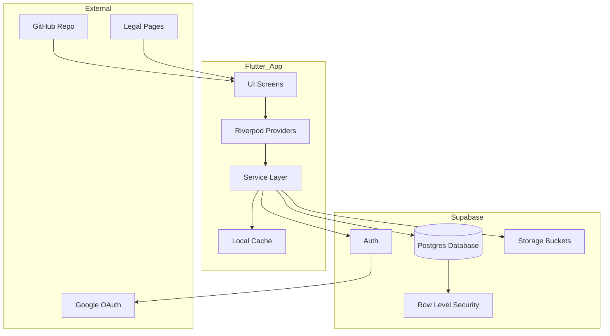
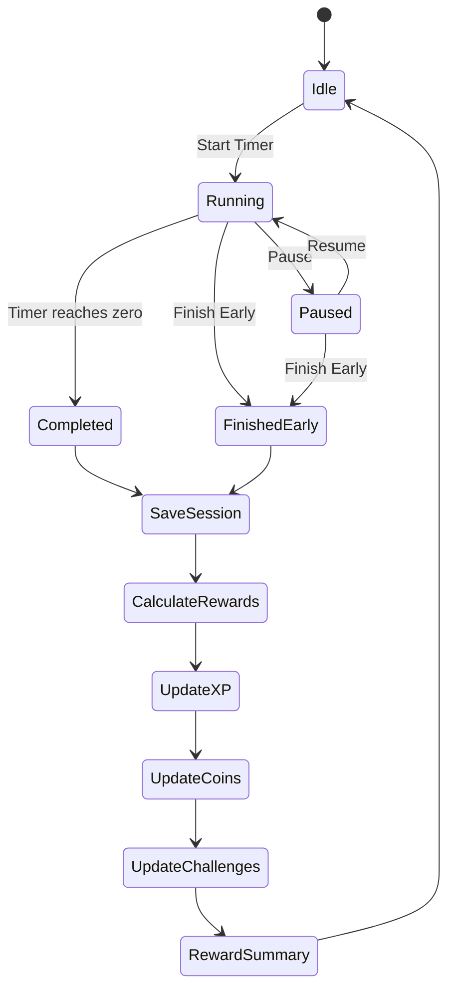
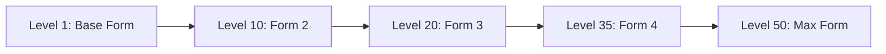
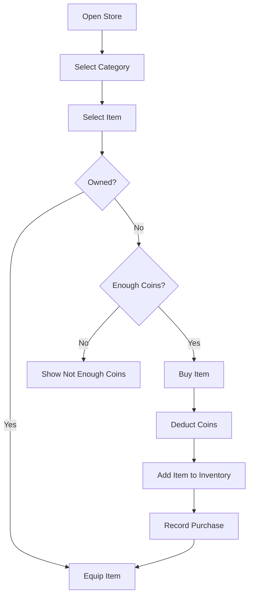
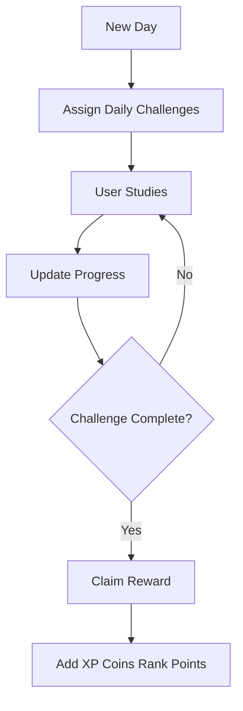
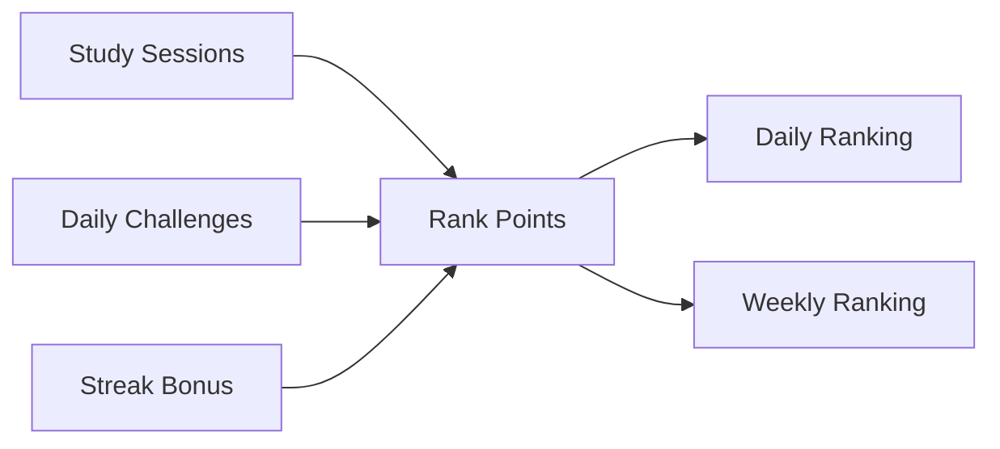
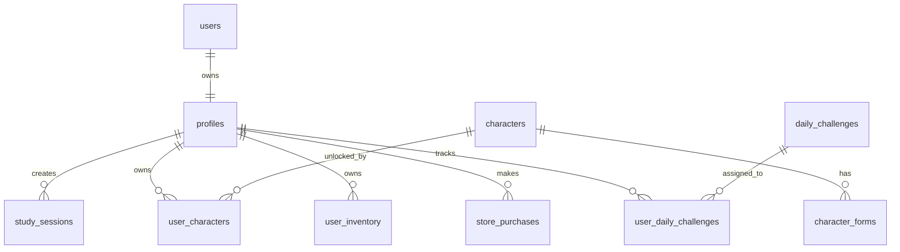
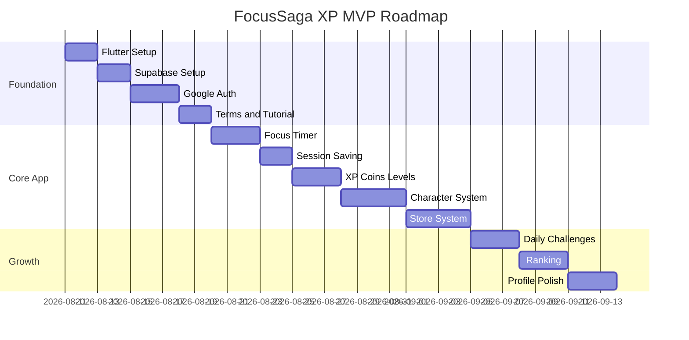

# FocusSaga XP

A gamified study timer app where users complete focus sessions, earn XP, level up original characters, collect coins, unlock rewards, and compete in daily rankings.

## Overview

FocusSaga XP is a Flutter-based mobile app designed to make studying feel rewarding and easy to continue.  
Users set a study timer, complete focused sessions, earn XP, level up characters, receive coins, unlock store items, and track progress through challenges and rankings.

The app is built for students and self-learners who want motivation beyond a basic study timer.

## Core Idea



## Key Features

- Google login using Supabase Auth
- Terms and Privacy Policy acceptance
- Beginner tutorial screens
- Countdown study timer
- Timer presets: 25 min, 50 min, 2 hours, custom
- Pause, resume, and finish early
- XP based on actual focused minutes
- Character leveling system
- 50 starting coins for new users
- 20 coins on every character level up
- Store for characters, backgrounds, timer skins, and reward animations
- Daily challenges
- Daily and weekly rankings
- Profile and progress tracking

## Tech Stack

| Layer | Technology |
|---|---|
| Mobile App | Flutter |
| Language | Dart |
| Backend | Supabase |
| Authentication | Supabase Auth + Google OAuth |
| Database | Supabase Postgres |
| Storage | Supabase Storage |
| State Management | Riverpod |
| Routing | go_router |
| Legal Pages | Next.js / Vercel / GitHub Pages |
| Version Control | GitHub |

## App Flow



## System Architecture



## Timer Flow



## Reward System

### XP Rules

| Action | Reward |
|---|---|
| 1 focused minute | 1 XP |
| Full timer completion | +20% XP bonus |
| Character level up | +20 coins |
| New user bonus | 50 coins |
| Daily challenge complete | XP / coins / rank points |

### Example

| Session | Actual Time | Completed | XP |
|---|---:|---|---:|
| Short session | 25 min | Yes | 30 XP |
| Deep session | 120 min | Yes | 144 XP |
| Early finish | 18 min | No | 18 XP |

## Character System

Each character has:

- Name
- Rarity
- Coin price
- XP
- Level
- 5 evolution forms
- Idle animation
- Victory animation
- Locked/unlocked state

Character evolution unlocks:



All characters must be original anime-inspired characters. Real anime, Marvel, DC, game, movie, or cartoon characters should not be used.

## Store System

Store categories:

- Characters
- Backgrounds
- Timer skins
- Reward animations



## Daily Challenges

Example challenges:

- Study 25 minutes today
- Complete 2 focus sessions
- Study 120 minutes today
- Complete one session without pause
- Level up any character
- Use a new background



## Leaderboard System

Ranking is based on real study activity.

```text
rank_points = focused_minutes + challenge_bonus + streak_bonus
```

Leaderboard types:

- Daily leaderboard
- Weekly leaderboard
- Friends leaderboard later
- Group/class leaderboard later



## Database Design



## Main Database Tables

| Table | Purpose |
|---|---|
| profiles | User profile, coins, level, selected items |
| terms_acceptance | Terms and privacy acceptance records |
| characters | Character catalog |
| character_forms | Character evolution forms |
| user_characters | User-owned characters and XP |
| backgrounds | Background catalog |
| timer_skins | Timer skin catalog |
| reward_animations | Reward animation catalog |
| user_inventory | Owned store items |
| store_purchases | Purchase history |
| study_sessions | Focus session records |
| daily_challenges | Challenge templates |
| user_daily_challenges | User challenge progress |

## Flutter Folder Structure

```text
lib/
  main.dart
  app/
    app.dart
    router.dart
    theme.dart
  core/
    constants/
    utils/
    errors/
  services/
    supabase_service.dart
    auth_service.dart
    profile_service.dart
    timer_service.dart
    store_service.dart
    challenge_service.dart
    ranking_service.dart
  features/
    auth/
    onboarding/
    terms/
    focus/
    characters/
    store/
    challenges/
    ranking/
    profile/
  shared/
    widgets/
    models/
    styles/
```

## Setup Requirements

Required accounts:

- GitHub
- Supabase
- Google Cloud Console
- Vercel / GitHub Pages for legal pages

Required tools:

- Flutter SDK
- Android Studio
- VS Code
- Git
- Android emulator or Android phone
- Java keytool

Android package name:

```text
com.startupzilla.focussagaxp
```

## MVP Roadmap



## Build Milestones

1. Flutter project setup
2. Theme and routing
3. Supabase connection
4. Google login
5. Profile creation
6. Terms and Privacy screen
7. Tutorial screens
8. Main app shell
9. Focus timer UI
10. Timer logic
11. Study session saving
12. XP, coins, and level system
13. Character system
14. Store system
15. Daily challenges
16. Leaderboard
17. Profile screen
18. Testing and release preparation

## Security Rules

- Users can read and update only their own profile.
- Users can read public store and character data.
- Users can write only their own sessions, inventory, purchases, and challenge progress.
- Users cannot edit master store items.
- Leaderboard should expose only safe public profile data.
- Paid coins should not affect ranking.

## Legal Rules

FocusSaga XP should use only original characters and assets.

Do not use:

- Real anime characters
- Real anime transformation names
- Marvel or DC characters
- Movie, game, or cartoon characters
- Protected logos
- Copied costumes or names

## Future Scope

- Friends leaderboard
- Group/class leaderboard
- Seasonal events
- Push notifications
- Streak freeze
- Parent/teacher reward dashboard
- Premium cosmetics
- Admin panel
- Analytics dashboard

## License

No license selected yet.

Before public release, decide whether this project should remain proprietary or use an open-source license such as MIT or Apache-2.0.
